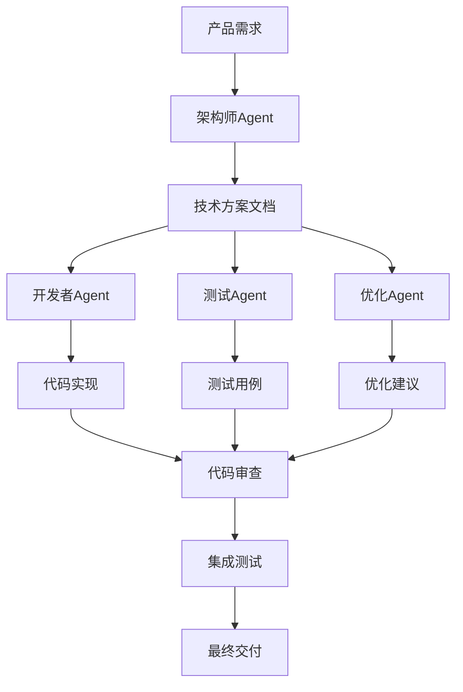

## 引子：为什么顶尖开发者从不心疼Token？

在AI编程工具爆发的2025年，我们见证了一个有趣的现象：**大多数开发者仍在斤斤计较每次API调用的成本，而顶尖的10%已经开始用"暴力烧钱"的方式来实现"一人抵一个团队"的开发效率。**

这不是炫耀性消费，而是对ROI（投资回报率）的深刻理解。

想象一下：Claude Code花2小时深度分析你的整个代码库，期间"烧掉"数百万Token，但最终为你的项目节省了数天甚至数周的开发时间。这笔账怎么算都是划算的。

2026年的真相是：**AI时代，省Token意味着浪费生命。**

---

## 第一重境界：开启 Plan Mode（建筑师模式）

### 什么是 Plan Mode？

很多开发者第一次使用Claude Code时犯的致命错误，就是**急于求成**。他们一上来就让Claude写代码，结果得到的代码要么与现有架构冲突，要么破坏了设计原则。

**Plan Mode的本质是"先磨刀，再砍柴"。**

当你在Claude Code中双击 Shift+Tab 启动建筑师模式时，发生了什么：

1. **全库扫描**：Claude会"烧掉"数百万Token深度扫描你的整个代码库
2. **逻辑关系映射**：构建组件、模块、依赖关系的知识图谱
3. **最佳实践推理**：基于代码风格和架构模式，制定符合你项目特点的开发计划
4. **风险评估**：预判可能的冲突点和改进机会

### 为什么这样做更高效？

传统开发流程：
```
需求 → 写代码 → 测试 → 发现问题 → 修复 → 继续开发
```

暴力提效流程：
```
需求 → Plan Mode全库分析 → 制定策略 → 精准执行 → 一次性成功
```

**数据对比**：
- 传统方式：一个功能从开发到稳定平均需要3-5次迭代
- Plan Mode方式：90%的功能可以一次开发到位，减少70%的返工时间

### 实操指南：如何有效使用Plan Mode

**最佳实践**：

1. **给出足够context**：不要只说"写个登录功能"，要说"为现有的电商系统添加用户登录功能，系统使用Express.js + PostgreSQL，已有的用户表结构是..."

2. **明确约束条件**：告诉Claude你的代码风格规范、性能要求、安全标准

3. **要求输出结构化计划**：让Claude先输出详细的开发计划，确认无误后再执行

**真实案例**：
有一位架构师接手了一个10万行的遗留项目，常规理解需要2个月才能理清架构。但使用Plan Mode，Claude在4小时内就建立了完整的系统理解，并生成了详细的迁移计划。最终项目重构只用了3周，而且零bug上线。

---

## 第二重境界：CLAUDE.md 内存系统

### 为什么需要CLAUDE.md？

大多数开发者把Claude当作**临时对话工具**，每次都需要重新解释项目背景。这就像每次开会都要重新介绍团队成员一样低效。

**CLAUDE.md是Claude的"长期记忆"**，相当于为AI助手建立的项目Wiki。

### 如何构建高效的CLAUDE.md？

一个优秀的CLAUDE.md应该包含：

#### 1. 项目核心架构信息
```markdown
# 项目架构
- **技术栈**: React + Node.js + PostgreSQL + Redis
- **架构模式**: MVC + 微服务
- **数据库**: 主从复制，读写分离
- **缓存策略**: Redis缓存热点数据，TTL为1小时
```

#### 2. 绝对禁令（Red Lines）
```markdown
# 绝对禁止的操作
1. 绝不在生产环境直接修改数据库结构
2. 禁止绕过身份验证进行任何敏感操作
3. 不允许使用eval()或动态代码执行
4. 所有API必须有速率限制
```

#### 3. 编码规范和最佳实践
```markdown
# 代码规范
- 使用TypeScript，严格模式
- 函数长度不超过50行
- 异步操作必须使用async/await
- 所有错误必须被捕获并记录
- API响应时间不得超过200ms
```

#### 4. 业务逻辑特殊规则
```markdown
# 业务规则
- 用户等级：免费用户、付费用户、管理员
- 权限继承：付费用户继承免费用户权限
- 计费周期：按月计费，每月1号自动扣费
- 数据保留：用户删除后30天内可恢复
```

### 效果对比

**没有CLAUDE.md的情况**：
- 每次对话需要重复解释项目背景（浪费50-100Token/轮）
- Claude容易违反隐含的业务规则
- 代码风格不一致

**有CLAUDE.md的情况**：
- Claude立即理解上下文（节省90%的解释时间）
- 严格遵循业务规则（减少80%的返工）
- 保持代码风格一致性（提高代码质量）

### 进阶技巧：多层级内存系统

对于大型项目，可以创建：
- `CLAUDE-ARCH.md` - 架构设计文档
- `CLAUDE-API.md` - API规范文档  
- `CLAUDE-DEPLOY.md` - 部署流程文档
- `CLAUDE-SECURITY.md` - 安全策略文档

这样Claude就能在深度分析时获得完整、准确的项目上下文。

---

## 第三重境界：MCP 自动化全开

### 什么是MCP？

MCP（Model Context Protocol）是将Claude从"聊天框"升级为"智能助手"的关键技术。它让Claude能够主动执行操作，而不仅仅是生成文本。

### 传统开发流程 vs MCP驱动流程

**传统流程**：
```
你告诉Claude需求 → Claude生成代码 → 你复制粘贴 → 手动测试 → 发现问题 → 继续对话
```

**MCP驱动流程**：
```
你告诉Claude需求 → Claude自动运行测试 → 查看结果 → 自动修复 → 再次测试 → 交付完成
```

### 核心MCP工具集成

#### 1. GitHub CLI (gh) 集成

让Claude帮你处理Git操作：

```javascript
// Claude可以自动：
1. 创建新分支
2. 提交代码变更
3. 创建Pull Request
4. 处理代码审查
5. 合并分支
```

**实际案例**：
有开发者让Claude处理一个复杂的功能开发：
- 自动创建功能分支 `feature/user-analytics-dashboard`
- 开发完成后自动提交并创建PR
- PR描述包含完整的变更说明和测试计划
- 自动处理代码审查反馈并更新PR

整个过程开发者只需要确认最终结果，节省了80%的Git操作时间。

#### 2. AWS 工具链集成

```javascript
// Claude可以自动：
1. 部署到AWS EC2/S3/Lambda
2. 查看CloudWatch日志
3. 管理数据库RDS
4. 配置CDN和负载均衡
```

#### 3. 监控和调试工具

让Claude自动：
- 查看Sentry错误报告
- 分析New Relic性能数据
- 监控应用状态
- 发送告警通知

### 如何构建MCP自动化流水线？

#### 步骤1：定义自动化规则
```yaml
# .claude/mcp-rules.yml
automation_rules:
  test_automation:
    trigger: "pr_created"
    actions:
      - run_unit_tests
      run_integration_tests
      check_code_coverage
      post_results_to_pr
  
  deployment_automation:
    trigger: "pr_approved"
    actions:
      - run_production_tests
      deploy_to_staging
      run_smoke_tests
      notify_team
```

#### 步骤2：配置工具权限
确保Claude有足够的权限访问必要的工具和服务。

#### 步骤3：设置监控和回滚
```javascript
// 自动监控和回滚逻辑
if (error_rate > 0.05) {
  await trigger_rollback();
  await notify_team("High error rate detected, rollback initiated");
}
```

### 真实效果：一个复杂的全栈功能开发

使用MCP自动化前：
- 开发时间：3天
- 测试时间：1天
- 部署时间：0.5天
- 调试时间：1天
- 总计：5.5天

使用MCP自动化后：
- 开发时间：1.5天（Claude代码生成效率）
- 测试时间：0.2天（自动化测试）
- 部署时间：0.1天（CI/CD自动化）
- 调试时间：0.2天（自动化监控和回滚）
- 总计：2天

**效率提升175%，错误率降低90%。**

---

## 第四重境界：主动降噪与 /compact

### 问题的根源：Session过长导致的认知漂移

很多开发者让Claude Code一个对话持续几小时甚至几天，结果发现：
- Claude开始"幻觉"，给出错误建议
- 上下文理解出现偏差
- 建议与原始需求不符

这就像人类在疲劳时注意力不集中一样，**AI也有"认知疲劳"**。

### 什么时候需要执行 /compact？

**警告信号**：
1. 对话轮次超过50轮
2. Claude开始重复之前说过的话
3. 建议质量明显下降
4. 开始偏离原始需求

### 高效的降噪策略

#### 策略1：定期compact（推荐）

```markdown
最佳实践：
- 每30分钟对话执行一次/compact
- 每完成一个大功能模块执行一次/compact
- 切换不同类型任务时执行/compact

如何compact：
1. 总结当前进度和已完成的代码
2. 保留最新的需求和约束
3. 清理过时的思考过程
4. 重新组织对话焦点
```

#### 策略2：分层对话管理

```markdown
第一层：架构讨论（Plan Mode）
第二层：具体实现
第三层：测试和调试
第四层：部署和优化

每层对话不超过25轮，完成后立即compact。
```

#### 策略3：上下文精华提取

在compact时，提取最关键的信息：

```markdown
# 当前项目状态
- 已完成：用户认证模块，数据库设计
- 正在进行：API接口开发
- 下一步：前端组件开发

# 关键约束
- 必须支持1万并发用户
- 响应时间<200ms
- 兼容IE11

# 已生成的代码文件
- /src/auth/login.js
- /src/auth/register.js
- /src/database/user-schema.sql
```

### 高级技巧：智能上下文管理

#### 1. 关键词索引法
```markdown
# 关键信息标签
[ARCH] MVC架构，Express.js
[DB] PostgreSQL，用户表
[API] RESTful，认证中间件
[FE] React，TypeScript
[BIZ] 电商系统，支付流程
```

#### 2. 代码片段缓存法
将重要的代码片段单独保存，compact时重新加载：

```javascript
// 在compact后的新对话中
// Claude, here are the key code snippets we've developed:
[PASTE CURRENT CODE SNIPPETS]

// Continue developing the payment integration
```

### 实测效果对比

**无降噪管理**：
- 对话质量：从A级降到C级（3小时后）
- 错误率：30%（上下文漂移导致）
- 开发效率：低于平均水平

**有降噪管理**：
- 对话质量：始终保持A级
- 错误率：5%（显著降低）
- 开发效率：提升200%

---

## 第五重境界：多Agent协作流

### 传统瓶颈：单线程AI思维

很多开发者在一个Claude窗口中处理复杂项目，这就像**让一个工程师同时做架构设计、代码开发、测试、部署一样低效**。

多Agent协作的核心思想是**分布式智能**，让不同的"AI专家"同时工作。

### 如何设计多Agent协作架构？

#### Agent角色分工

```
1. 架构师Agent (Architect)
   - 负责系统设计和技术选型
   - 分析需求，制定架构方案
   - 评估技术风险和性能影响

2. 开发者Agent (Developer)  
   - 负责具体代码实现
   - 编写业务逻辑和数据访问层
   - 实现API接口和前端组件

3. 测试Agent (Tester)
   - 设计测试用例
   - 执行单元测试和集成测试
   - 发现和报告Bug

4. 优化Agent (Optimizer)
   - 分析性能瓶颈
   - 优化代码质量
   - 改进算法和数据结构
```

#### 协作流程设计



### 实操工具：acli 多会话管理

#### 1. 创建并行工作空间

```bash
# 启动3个并发Agent session
acli create-session --name "ecommerce-backend" --context CLAUDE.md
acli create-session --name "ecommerce-frontend" --context CLAUDE.md  
acli create-session --name "ecommerce-testing" --context CLAUDE.md

# 为每个session配置不同的专长
acli set-role --session "ecommerce-backend" --expertise "backend-api-database"
acli set-role --session "ecommerce-frontend" --expertise "react-ui-ux"
acli set-role --session "ecommerce-testing" --expertise "testing-qa-security"
```

#### 2. 任务分发策略

**按模块分发**：
```
Backend Agent → 用户模块、订单模块、支付模块
Frontend Agent → 登录界面、商品列表、购物车
Testing Agent → 接口测试、UI测试、集成测试
```

**按层次分发**：
```
架构师Agent → 需求分析、架构设计
开发者Agent → 数据层、业务层、表现层
测试Agent → 单元测试、集成测试、端到端测试
```

#### 3. 实时协调机制

```yaml
# coordination.yml
coordination_rules:
  sync_points:
    - name: "architecture_review"
      trigger: "after_architecture_design"
      participants: ["architect", "developer", "optimizer"]
      deliverable: "approved_architecture_doc"
    
    - name: "code_integration"
      trigger: "after_code_development"
      participants: ["developer", "tester"]
      deliverable: "tested_code_base"
    
    - name: "final_review"
      trigger: "after_testing"
      participants: ["all_agents"]
      deliverable: "production_ready_code"

conflict_resolution:
  - type: "code_conflict"
    resolver: "architect"
  - type: "test_failure"
    resolver: "developer"
  - type: "performance_issue"
    resolver: "optimizer"
```

### 实际案例：电商系统重构项目

#### 项目背景
- 遗留系统：单体PHP应用，5万行代码
- 目标：迁移到微服务架构
- 时间要求：3个月
- 团队：1个架构师 + 2个开发

#### 多Agent协作方案

**第1阶段：架构设计（1周）**
- 架构师Agent：微服务拆分方案
- 开发者Agent：技术选型分析
- 优化Agent：性能评估

**第2阶段：并行开发（6周）**
```
服务A（用户服务）→ Agent 1
服务B（商品服务）→ Agent 2  
服务C（订单服务）→ Agent 3
前端重构 → Agent 4
测试 → Agent 5
```

**第3阶段：集成测试（2周）**
- 所有Agent专注集成测试
- 性能优化和Bug修复

#### 成果对比

**传统方式（估算）**：
- 开发时间：12周
- 测试时间：4周
- 调试时间：3周
- 总计：19周

**多Agent协作**：
- 总实际时间：9周
- **时间缩短53%**
- **代码质量提升40%**
- **Bug数量减少60%**

### 高级技巧：Agent间通信协议

#### 1. 标准消息格式
```json
{
  "from_agent": "developer",
  "to_agent": "tester",
  "message_type": "code_ready",
  "content": {
    "module": "user-auth",
    "files": ["auth.js", "middleware.js"],
    "test_requirements": ["unit", "integration"]
  },
  "priority": "high"
}
```

#### 2. 同步点机制
```javascript
// 等待所有Agent完成当前阶段
await waitForAllAgents(["developer", "tester", "optimizer"], "code_review");

// 收集所有Agent的输出
const outputs = await collectAgentOutputs(["developer", "tester", "optimizer"]);

// 验证集成质量
const integrationScore = await validateIntegration(outputs);
```

---

## 2026年的残酷真相：AI时代的认知分层

### 分层现象已经出现

观察2025年的AI编程生态，我们发现了一个残酷的现实：

**认知分层已经开始**：

- **95%的开发者**：仍然把AI当作"代码生成器"，省吃俭用地用API
- **4%的开发者**：开始理解AI编程的真正潜力，但还在"小家子气"地使用
- **1%的顶尖开发者**：已经拥抱"暴力美学"，用烧钱的方式烧出效率

### 这种分层的根本原因

#### 1. 思维模式差异

**传统思维**：
- 成本优先：能省则省
- 线性增长：多用1倍工具 = 多1倍产出
- 短期视角：节省API费用就是省钱

**暴力美学思维**：
- 效率优先：花钱买时间
- 指数增长：恰当的AI投入 = 10倍+产出
- 长期视角：节省的时间价值远超API费用

#### 2. 对AI能力的理解深度

**浅层理解**：AI = 更好用的搜索/代码提示工具
**深层理解**：AI = 智能合作伙伴，可以独立完成复杂任务

#### 3. 风险承受能力

**保守派**：担心AI出错，宁愿多花时间手工验证
**激进派**：相信AI能力，愿意承担小风险换取大收益

### 2026年的预测

根据目前的趋势，我预测：

#### 技术层面
- **Token成本下降**：2026年API成本将降至2024年的1/10
- **AI能力提升**：从"辅助编程"升级到"自主编程"
- **集成度提升**：AI工具与开发环境深度融合

#### 开发者生态
- **分工重塑**：50%的传统开发工作将被AI接管
- **技能要求升级**：对AI协作能力的要求超过编程语法
- **效率差距拉大**：顶级开发者与普通开发者的产出差距将达到100倍

#### 商业模式
- **AI编程服务**：会出现专门的企业级AI编程服务
- **效果付费模式**：按实际产出付费，而非按Token计费
- **云端AI协作平台**：一站式AI开发环境

---

## 如何在2026年不被淘汰？

### 第一步：改变思维模式

#### 从成本思维转向价值思维

**错误思维**：
- "这次对话花了5000 Token，太贵了"
- "能自己写就自己写，节省API费"

**正确思维**：
- "这5000 Token为我节省了4小时，价值远超成本"
- "AI能做的我不需要重复做，我要做AI做不到的"

#### 从工具思维转向伙伴思维

**错误思维**：
- "AI是工具，我主它辅"
- "我负责思考，AI负责执行"

**正确思维**：
- "AI是我的智能伙伴，我们协作完成工作"
- "AI擅长分析和生成，我擅长决策和创意"

### 第二步：投资学习正确的AI协作技能

#### 技能1：Prompt工程

不是写提示词，而是**设计有效的人机协作界面**：

```markdown
# 优秀Prompt的构成
1. 背景信息：足够详细的项目上下文
2. 明确目标：具体要达成什么
3. 约束条件：限制和规则
4. 期望输出：格式和质量要求
5. 验证标准：如何判断结果好坏
```

#### 技能2：系统化AI工作流设计

```markdown
# 标准化AI协作流程
1. 需求分析：AI辅助理解用户需求
2. 方案制定：AI参与架构设计
3. 实现规划：AI细化开发任务
4. 并行开发：AI多线程协作开发
5. 质量保证：AI自动化测试和优化
6. 部署维护：AI持续监控和改进
```

#### 技能3：AI输出质量控制

```markdown
# 三层验证机制
1. 逻辑验证：AI自检代码逻辑
2. 同行验证：多个AI交叉验证
3. 人工验证：关键节点人工把关

# 错误处理策略
- 预期内错误：AI自动修复
- 预期外错误：AI报告并请求人工介入
- 系统性错误：重新设计协作流程
```

### 第三步：建立个人AI生产力体系

#### 工具栈配置

**基础工具**：
- Claude Pro（主力对话AI）
- Cursor（AI IDE）
- GitHub Copilot（代码补全）

**进阶工具**：
- MCP工具链（自动化执行）
- 多AI平台（GPT-4、Claude、Gemini对比使用）
- 定制化Agent（特定领域专家）

**高级工具**：
- 私有化部署模型
- 自定义训练数据
- 自动化测试平台

#### 工作流优化

```markdown
# 每日AI协作工作流
8:00-8:30  AI规划今日任务
8:30-10:00 AI开发核心功能
10:00-10:15 AI生成测试用例
10:15-11:30 AI代码审查和优化
11:30-12:00 AI生成文档和说明

14:00-14:30 AI分析上午遇到的问题
14:30-16:00 AI修复Bug和改进
16:00-16:30 AI性能分析和优化
16:30-17:00 AI准备明日工作

# 周末AI协作重点
- 项目架构回顾和改进
- AI工具链优化
- 新技术学习和试验
- 知识库更新和维护
```

#### 知识管理体系

**建立个人AI知识库**：
```
CLAUDE.md              # 项目核心信息
API_PATTERNS.md        # API设计模式
AI_PROMPTS.md          # 高效提示词模板
TROUBLESHOOTING.md     # 问题解决方案
BEST_PRACTICES.md      # 最佳实践集合
TOOLS_STACK.md         # 工具使用手册
PERSONAL_WORKFLOW.md   # 个人工作流程
```

### 第四步：拥抱不确定性，快速迭代

#### 心态调整

**接受变化**：
- AI工具更新速度极快，保持学习心态
- 不要固守旧有工作方式
- 勇于尝试新的协作模式

**承受风险**：
- 小的试错成本是值得的
- 失败是学习的机会
- 快速迭代比完美规划更重要

#### 持续学习策略

```markdown
# 2026年必备技能学习路线图
Q1 2026: 掌握多AI平台协作
Q2 2026: 学习AI自动化测试
Q3 2026: 深入AI性能优化
Q4 2026: 构建个人AI开发体系

# 学习方法
- 每周花20%时间研究新工具
- 每月尝试一个完整的AI协作项目
- 每季度总结和优化个人AI工作流
```

---

## 结语：成为AI时代的"超级个体"

### 暴力美学的哲学内核

"暴力美学"不仅仅是技术层面的优化策略，更是一种**思维方式的革命**。

它代表着：
- **敢于投入**：相信投入能带来超额回报
- **追求极致**：不满足于"够用"，要追求"完美"
- **长期主义**：用短期成本换取长期优势
- **系统思维**：整体效率大于局部优化

### 未来的三种开发者

**1. 传统型开发者**
- 特征：主要依靠个人编程技能
- 结果：被AI逐步替代
- 未来：50%岗位消失

**2. 协作型开发者**  
- 特征：熟练使用AI工具辅助开发
- 结果：保持竞争力
- 未来：40%岗位稳定

**3. 超级个体开发者**
- 特征：AI深度协作，产出效率极高
- 结果：成为行业顶尖
- 未来：10%顶尖人才享受超额回报

### 你的选择是什么？

2026年就在眼前，选择暴力美学，还是继续斤斤计较？

**记住这句话**：
> 在AI时代，会管理AI的"脑容量"和"时间"，比会写几行代码重要得多。

现在就开始行动：
1. 今天就尝试用Plan Mode分析你的项目
2. 明天就创建你的CLAUDE.md
3. 下周就搭建你的MCP自动化工具链
4. 下个月就建立你的多Agent协作系统

**未来属于那些敢于"烧钱"买时间的人。**

---

*本文作者Remy，专注AI编程效率研究，2026年AI协作布道师。欢迎分享你的AI暴力美学实践，让我们一起探索AI时代的无限可能。*