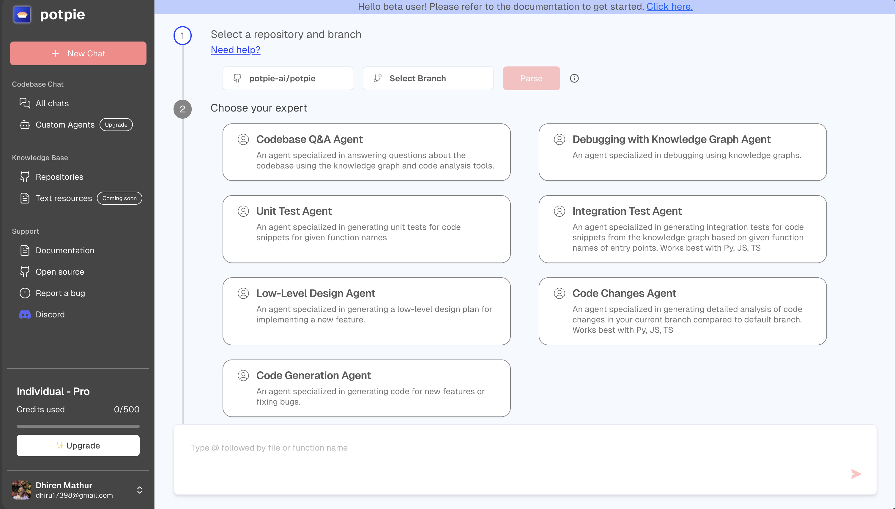

# 多智能体系统调研报告

## 1. 多智能体系统概述
- 定义:什么是智能体？
- 概念澄清：workflow 与 (multi-)agent system 的区别与联系

## 2. 多智能体系统的设计模式

### 2.1 基础内容：从工作流到智能体
- 如何区分并选择工作流vs智能体架构
- 从简单到复杂：循序渐进的构建方法论

### 2.2 多智能体的关键构成部分

- 智能体(Agents)：LLM能够动态指导自身流程和工具使用的系统,可以自主控制任务完成方式。

- 环境(Environment): 智能体所处的外部世界,智能体可以感知并作用于环境。环境可以是软件世界，也可以是工厂、道路、电网等物理空间。

- 交互(Interactions): 智能体之间通过标准的通信语言进行沟通。根据系统需求,智能体之间的交互包括合作、协调、谈判等多种形式。

- 组织(Organization): 智能体可以采用层级控制的方式组织,也可以基于涌现行为进行自组织。

## 3. 关键模块
### 3.1 基本组成部件

* **多智能体系统结构**：

  * **Equi-Level Structure**：研究了在同一层次上运作的智能体系统，如DMAS（Chen et al., 2023）。

  * **Hierarchical Structure**：探讨了具有领导和追随者角色的层次结构，如Stackelberg游戏（Von Stackelberg, 2010; Conitzer & Sandholm, 2006; Harris et al., 2023）。

  * **Nested Structure**：研究了嵌套结构或混合结构，如（Chan et al., 2023）。

  * **Dynamic Structure**：讨论了多智能体系统的动态结构，如（Talebirad & Nadiri, 2023）。

* **规划（Planning）**：

  * **Global Planning**：涉及理解整体任务并将任务分解为子任务，以及协调智能体之间的工作流程。

  * **Single-Agent Task Decomposition**：在单个智能体中，任务分解涉及将大任务分解为一系列可管理的小任务。

* **记忆/上下文管理（Memory Management）**：

  * **Short-term Memory**：在对话或交互期间使用的即时、短暂的记忆。

  * **Long-term Memory**：存储历史对话和响应的记忆。

  * **External Data Storage**：如RAG（Lewis et al., 2020），用于补充信息源。

  * **Episodic Memory**：涉及多智能体系统中一系列交互的记忆。

  * **Consensus Memory**：在多智能体系统中，作为共享信息的统一来源。

【cite】LLM Multi-Agent Systems: Challenges and Open Problems

### 3.2 底层框架选择
- 框架选择的关键考量：何时使用，何时避免
- 现有通用框架介绍：langgraph, autogen, swarm
- 选型建议

### 3.3 多智能体应用的交互设计
- 交互设计原则：
  - 任务优先：多智能体应用应当为每个任务定制最佳的交互界面，符合作业流程设计，而不是聊天窗口通吃。
  - 细节屏蔽：用户不需要了解智能体内部的实现细节，只需要了解智能体的外部行为和交互方式
  - 交互简洁：用户与智能体之间的交互应当尽可能简洁，避免复杂的操作流程
  - 反馈充分：智能体的行为和决策过程应当有清晰的反馈
  - 可控性：用户应当能够干预和调整智能体的行为

- 典型产品案例分析：
  - 多智能体应用(代码开发)：cline, devin, cursor agent
  - 多智能体应用(撰写)： deep researcher, 
  - 多智能体搭建平台：coze，langgraph studio

### 3.4 效果评测方法、数据集与指标
- 基准测试
  - 公开的benchmark\
    - ToolBench:  GitHub - OpenBMB/ToolBench: [ICLR'24 spotlight] An open platform for training, serving, and evaluati\
      大规模工具调用指令数据集，支持多步推理与真实API集成	
    - SWE-bench: https://github.com/princeton-nlp/SWE-bench\
      评估LLM解决GitHub问题的基准，含2,294个Python代码修复任务	
    - Mind2Web: https://huggingface.co/datasets/osunlp/Mind2Web\
      通用网页交互数据集，覆盖多样化DOM操作与用户轨迹	
    - WebArena: GitHub - web-arena-x/webarena: Code repo for "WebArena: A Realistic Web Environment for Building Aut\
      真实网页环境测试平台，集成4个应用与工具库		
    - AgentInstruct: https://huggingface.co/datasets/THUDM/AgentInstruct\
      高质量智能体指令数据集，增强模型任务泛化能力		
      
- 评测指标
  - 性能指标
    - 任务解决率（% Resolved）
      - 核心效能指标，反映系统解决问题的能力

    - 定位准确性（F1 Score）
      - 代码缺陷定位的精确率与召回率平衡

    - 视觉必要性影响（Visual Necessity Impact）
      - 图像输入对任务解决率的提升幅度

    - 图像类型敏感度（Image Type Sensitivity）
      - 对不同类型图像（代码截图/UI图/图表）的适应性

    - 代码修改复杂度（Patch Complexity）
      - 参考解决方案的修改规模（文件数/行数/函数数）

    - 任务难度分布（Task Difficulty Distribution）
      - 不同耗时任务的占比（简单/中等/困难/极难）
    - 任务成功率
      - 参考：https://www.restack.io/p/multi-agent-systems-answer-llm-evaluation-cat-ai
      - 该指标衡量代理成功完成的任务的百分比，直接表明整体效率。
      - **公式**：
        $$ \text{Task Success Rate} = \frac{\text{成功完成的任务数}}{\text{总任务数}} \times 100\% $$
    - 协作效率
      - 参考：https://www.restack.io/p/multi-agent-systems-answer-llm-evaluation-cat-ai
      - 评估多个代理如何有效地合作以实现共同目标
    - 任务分配准确性（Task Allocation Accuracy）
      - 参考：https://www.restack.io/p/multi-agent-systems-answer-llm-evaluation-cat-ai
      - 任务是否分配给最合适的代理
      - **公式**：
        $$ \text{Task Allocation Accuracy} = \frac{\text{正确分配的任务数}}{\text{总任务数}} \times 100\% $$  
    - 任务完成准确率（Task Completion Accuracy）
      - 参考：https://www.restack.io/p/multi-agent-systems-answer-llm-evaluation-cat-ai
      - 输出结果的准确性
      - **公式**：
        $$ \text{Task Completion Accuracy} = \frac{\text{输出正确的结果数}}{\text{总完成任务数}} \times 100\% $$
    - 输出连贯性（Output Coherence）
      - 参考：https://www.restack.io/p/multi-agent-systems-answer-llm-evaluation-cat-ai
      - 生成内容的逻辑一致性。
    - 进度率（Progress Rate）
      - 参考：AgentBoard https://arxiv.org/pdf/2401.13178
      - 通过子目标匹配或状态相似度计算的连续指标，反映任务完成过程中的渐进进展（0到1）
      - **公式**：
        - **连续任务**（如状态匹配）：
          $$ r_t^{\text{match}} = \max_{0 \leq i \leq t} f(s_i, g) $$
          其中，$f(s_i, g)$ 是当前状态 $s_i$ 与目标状态 $g$ 的相似度函数（如表格单元格匹配比例）。

        - **离散子目标任务**（如多步规划）：  
          $$ r_t^{\text{subgoal}} = \max_{0 \leq i \leq t} \frac{1}{K} \sum_{k=1}^K f(s_i, g_k) $$  
          其中，$g_k$ 是人工标注的第 $k$ 个子目标，$f(s_i, g_k) \in \{0,1\}$ 表示是否完成子目标。
  - 效率指标
    - 平均成本（$ Avg. Cost）
      - 单任务推理的经济成本
    - 异常终止率（Abnormal Termination Rate）
      - 因成本超限或错误导致任务中断的比例（反映资源浪费）
    - 通信延迟（Communication Latency）：代理响应时间（毫秒）。
    - 任务完成时间（Task Completion Time）
  - 可扩展性指标
    - 跨文件类型修改（Multi-file Type Editing）
      - 同时修改多种文件类型（TS/HTML/CSS）的任务占比

    - 语言适应性对比
      - Python-centric系统在JavaScript任务中的解决率衰减（

  - 可靠性指标
    - 测试一致性（Test Consistency）
      - 同一补丁多次运行的通过一致性

    - 错误恢复能力
      - 任务终止后自动重试或回滚机制的有效性
## 4. 应用领域

### 4.1 多智能体的特点与适用场景
- 多智能体的特点：非实时性，非确定性，  
- 多智能体适合的场景：离线操作，错误容忍，用户包容度较高且愿意干预。
- 何时(以及何时不)使用多智能体系统

### 4.2 多智能体在银行场景的典型应用
- 客服机器人: 从知识运营到智能客服
- 智能写作: 简单文案、调研报告式、营销文案式、
- 智能营销: 从客户画像到精准营销

## 5. 参考文献

<!-- Image reference removed due to missing file -->
<!--  -->
