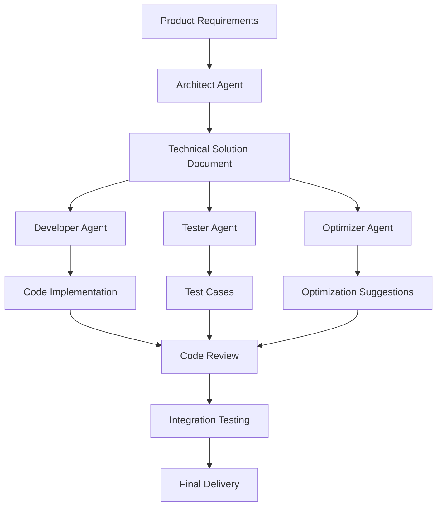

## Introduction: Why Top Developers Never Worry About Tokens?

In 2025, as AI programming tools exploded onto the scene, we've witnessed an interesting phenomenon: **Most developers are still penny-pinching on API costs, while the top 10% have already embraced "brutal money-burning" to achieve "one person equals an entire team" development efficiency.**

This isn't boastful spending—it's a deep understanding of ROI (Return on Investment).

Imagine this: Claude Code spends 2 hours deeply analyzing your entire codebase, "burning" millions of tokens in the process, but ultimately saving you days or even weeks of development time. How do you calculate that cost?

**The truth in 2026: In the AI era, saving tokens means wasting life.**

---

## First Realm: Enable Plan Mode (Architect Mode)

### What is Plan Mode?

The fatal mistake most developers make when first using Claude Code is **impatience**. They rush to have Claude write code, only to get code that conflicts with existing architecture or breaks design principles.

**The essence of Plan Mode is "sharpen the axe before cutting wood."**

When you press Shift+Tab twice to activate Architect Mode in Claude Code, here's what happens:

1. **Full Repository Scan**: Claude "burns" millions of tokens to deeply scan your entire codebase
2. **Logical Relationship Mapping**: Builds a knowledge graph of components, modules, and dependencies
3. **Best Practice Inference**: Develops coding plans based on your project's patterns and style
4. **Risk Assessment**: Anticipates potential conflict points and improvement opportunities

### Why Is This More Efficient?

Traditional development flow:
```
Requirement → Write Code → Test → Find Issues → Fix → Continue Development
```

Brutal efficiency flow:
```
Requirement → Plan Mode Full Analysis → Develop Strategy → Execute Precisely → Success First Time
```

**Data Comparison**:
- Traditional: An average feature requires 3-5 iterations from development to stability
- Plan Mode: 90% of features can be developed correctly the first time, reducing rework by 70%

### Practical Guide: How to Use Plan Mode Effectively

**Best Practices**:

1. **Provide Sufficient Context**: Don't just say "write a login feature"—say "add user login to the existing e-commerce system, which uses Express.js + PostgreSQL, with existing user table structure being..."

2. **Define Constraints Clearly**: Tell Claude your code style conventions, performance requirements, and security standards

3. **Request Structured Output**: Have Claude output a detailed development plan first, confirm it's correct, then execute

**Real Case Study**:
An architect took over a 100K-line legacy project. Conventional understanding suggested 2 months to clarify the architecture. But with Plan Mode, Claude established a complete system understanding in 4 hours and generated a detailed migration plan. The project refactoring took only 3 weeks and launched with zero bugs.

---

## Second Realm: CLAUDE.md Memory System

### Why Do You Need CLAUDE.md?

Most developers treat Claude as a **temporary chat tool**, needing to re-explain project context every time. It's like having to re-introduce team members at every meeting—equally inefficient.

**CLAUDE.md is Claude's "long-term memory"**, essentially creating a project Wiki for your AI assistant.

### How to Build an Effective CLAUDE.md?

An excellent CLAUDE.md should include:

#### 1. Core Project Architecture Information
```markdown
# Project Architecture
- **Tech Stack**: React + Node.js + PostgreSQL + Redis
- **Architecture Pattern**: MVC + Microservices
- **Database**: Master-slave replication, read-write separation
- **Cache Strategy**: Redis caching for hot data, 1-hour TTL
```

#### 2. Absolute Red Lines
```markdown
# Absolute Prohibitions
1. Never directly modify database structure in production
2. No bypassing authentication for any sensitive operations
3. No use of eval() or dynamic code execution
4. All APIs must have rate limiting
```

#### 3. Coding Standards and Best Practices
```markdown
# Code Standards
- Use TypeScript, strict mode
- Functions no longer than 50 lines
- Async operations must use async/await
- All errors must be caught and logged
- API response time must not exceed 200ms
```

#### 4. Business Logic Special Rules
```markdown
# Business Rules
- User levels: Free, Paid, Admin
- Permission inheritance: Paid users inherit Free user permissions
- Billing cycle: Monthly billing, auto-charge on 1st of each month
- Data retention: 30-day recovery period after user deletion
```

### Effect Comparison

**Without CLAUDE.md**:
- Each conversation needs to repeat project background (wasting 50-100 tokens/round)
- Claude easily violates implicit business rules
- Inconsistent code style

**With CLAUDE.md**:
- Claude immediately understands context (saving 90% explanation time)
- Strictly follows business rules (reducing 80% rework)
- Maintains consistent code style (improving code quality)

### Advanced Tips: Multi-Layer Memory System

 create:
- `For large projects,CLAUDE-ARCH.md` - Architecture design documentation
- `CLAUDE-API.md` - API specification documentation
- `CLAUDE-DEPLOY.md` - Deployment process documentation
- `CLAUDE-SECURITY.md` - Security policy documentation

This gives Claude complete, accurate project context during deep analysis.

---

## Third Realm: Full MCP Automation

### What is MCP?

MCP (Model Context Protocol) is the key technology that upgrades Claude from a "chat box" to a "smart assistant." It enables Claude to actively execute operations rather than just generate text.

### Traditional Development Flow vs. MCP-Driven Flow

**Traditional Flow**:
```
You tell Claude requirements → Claude generates code → You copy-paste → Manual testing → Find problems → Continue conversation
```

**MCP-Driven Flow**:
```
You tell Claude requirements → Claude automatically runs tests → Views results → Auto-fixes → Tests again → Delivers completed work
```

### Core MCP Tool Integrations

#### 1. GitHub CLI (gh) Integration

Let Claude handle Git operations for you:

```javascript
// Claude can automatically:
1. Create new branches
2. Commit code changes
3. Create Pull Requests
4. Handle code reviews
5. Merge branches
```

**Real Case Study**:
One developer had Claude handle complex feature development:
- Automatically created feature branch `feature/user-analytics-dashboard`
- After development, automatically committed and created PR
- PR description included complete change notes and test plans
- Automatically handled code review feedback and updated PR

The developer only needed to confirm the final result, saving 80% of Git operation time.

#### 2. AWS Toolchain Integration

```javascript
// Claude can automatically:
1. Deploy to AWS EC2/S3/Lambda
2. View CloudWatch logs
3. Manage RDS databases
4. Configure CDN and load balancers
```

#### 3. Monitoring and Debugging Tools

Let Claude automatically:
- View Sentry error reports
- Analyze New Relic performance data
- Monitor application status
- Send alert notifications

### How to Build an MCP Automation Pipeline?

#### Step 1: Define Automation Rules
```yaml
# .claude/mcp-rules.yml
automation_rules:
  test_automation:
    trigger: "pr_created"
    actions:
      - run_unit_tests
      run_integration_tests
      check_code_coverage
      post_results_to_pr
  
  deployment_automation:
    trigger: "pr_approved"
    actions:
      - run_production_tests
      deploy_to_staging
      run_smoke_tests
      notify_team
```

#### Step 2: Configure Tool Permissions
Ensure Claude has sufficient permissions to access necessary tools and services.

#### Step 3: Set Up Monitoring and Rollback
```javascript
// Auto monitoring and rollback logic
if (error_rate > 0.05) {
  await trigger_rollback();
  await notify_team("High error rate detected, rollback initiated");
}
```

### Real Effect: A Complex Full-Stack Feature Development

Before MCP automation:
- Development: 3 days
- Testing: 1 day
- Deployment: 0.5 days
- Debugging: 1 day
- Total: 5.5 days

After MCP automation:
- Development: 1.5 days (Claude code generation efficiency)
- Testing: 0.2 days (automated testing)
- Deployment: 0.1 days (CI/CD automation)
- Debugging: 0.2 days (automated monitoring and rollback)
- Total: 2 days

**175% efficiency improvement, 90% error rate reduction.**

---

## Fourth Realm: Active Noise Reduction and /compact

### Root Problem: Cognitive Drift from Long Sessions

Many developers let Claude Code conversations run for hours or even days, only to find:
- Claude starts "hallucinating," giving wrong advice
- Context understanding becomes biased
- Suggestions no longer match original requirements

Just like humans lose focus when tired, **AI also has "cognitive fatigue."**

### When to Execute /compact?

**Warning Signs**:
1. Over 50 conversation rounds
2. Claude starts repeating what was said before
3. Suggestion quality clearly declining
4. Starting to drift from original requirements

### Efficient Noise Reduction Strategies

#### Strategy 1: Regular Compact (Recommended)

```markdown
Best Practices:
- Execute /compact every 30 minutes of conversation
- Execute /compact after completing each major functional module
- Execute /compact when switching between different types of tasks

How to compact:
1. Summarize current progress and completed code
2. Keep latest requirements and constraints
3. Clear outdated thinking processes
4. Reorganize conversation focus
```

#### Strategy 2: Layered Conversation Management

```markdown
Layer 1: Architecture Discussion (Plan Mode)
Layer 2: Specific Implementation
Layer 3: Testing and Debugging
Layer 4: Deployment and Optimization

Each layer conversation should not exceed 25 rounds; compact immediately after completion.
```

#### Strategy 3: Context Essence Extraction

When compacting, extract the most critical information:

```markdown
# Current Project State
- Completed: User authentication module, database design
- In Progress: API interface development
- Next Step: Frontend component development

# Key Constraints
- Must support 10,000 concurrent users
- Response time < 200ms
- IE11 compatible

# Generated Code Files
- /src/auth/login.js
- /src/auth/register.js
- /src/database/user-schema.sql
```

### Advanced Tips: Intelligent Context Management

#### 1. Keyword Indexing Method
```markdown
# Key Information Tags
[ARCH] MVC architecture, Express.js
[DB] PostgreSQL, user table
[API] RESTful, auth middleware
[FE] React, TypeScript
[BIZ] E-commerce system, payment flow
```

#### 2. Code Snippet Caching Method
Save important code snippets separately and reload during compact:

```javascript
// In a new conversation after compact
// Claude, here are the key code snippets we've developed:
[PASTE CURRENT CODE SNIPPETS]

// Continue developing the payment integration
```

### Measured Effect Comparison

**Without Noise Management**:
- Conversation quality: Drops from A to C (after 3 hours)
- Error rate: 30% (due to context drift)
- Development efficiency: Below average

**With Noise Management**:
- Conversation quality: Maintains A level consistently
- Error rate: 5% (significantly reduced)
- Development efficiency: 200% improvement

---

## Fifth Realm: Multi-Agent Collaboration Flow

### Traditional Bottleneck: Single-Threaded AI Thinking

Many developers handle complex projects in a single Claude window—it's as inefficient as **having one engineer do architecture design, coding, testing, and deployment simultaneously.**

The core idea of Multi-Agent Collaboration is **distributed intelligence**, letting different "AI experts" work simultaneously.

### How to Design a Multi-Agent Collaboration Architecture?

#### Agent Role Division

```
1. Architect Agent
   - Responsible for system design and tech selection
   - Analyzes requirements, develops architecture plans
   - Evaluates technical risks and performance impacts

2. Developer Agent
   - Responsible for specific code implementation
   - Writes business logic and data access layers
   - Implements API interfaces and frontend components

3. Tester Agent
   - Designs test cases
   - Executes unit and integration tests
   - Finds and reports bugs

4. Optimizer Agent
   - Analyzes performance bottlenecks
   - Optimizes code quality
   - Improves algorithms and data structures
```

#### Collaboration Flow Design



### Practical Tool: acli Multi-Session Management

#### 1. Create Parallel Workspaces

```bash
# Start 3 concurrent Agent sessions
acli create-session --name "ecommerce-backend" --context CLAUDE.md
acli create-session --name "ecommerce-frontend" --context CLAUDE.md  
acli create-session --name "ecommerce-testing" --context CLAUDE.md

# Configure different expertise for each session
acli set-role --session "ecommerce-backend" --expertise "backend-api-database"
acli set-role --session "ecommerce-frontend" --expertise "react-ui-ux"
acli set-role --session "ecommerce-testing" --expertise "testing-qa-security"
```

#### 2. Task Distribution Strategy

**By Module Distribution**:
```
Backend Agent → User module, Order module, Payment module
Frontend Agent → Login interface, Product list, Shopping cart
Testing Agent → Interface testing, UI testing, Integration testing
```

**By Layer Distribution**:
```
Architect Agent → Requirements analysis, Architecture design
Developer Agent → Data layer, Business layer, Presentation layer
Tester Agent → Unit tests, Integration tests, End-to-end tests
```

#### 3. Real-Time Coordination Mechanism

```yaml
# coordination.yml
coordination_rules:
  sync_points:
    - name: "architecture_review"
      trigger: "after_architecture_design"
      participants: ["architect", "developer", "optimizer"]
      deliverable: "approved_architecture_doc"
    
    - name: "code_integration"
      trigger: "after_code_development"
      participants: ["developer", "tester"]
      deliverable: "tested_code_base"
    
    - name: "final_review"
      trigger: "after_testing"
      participants: ["all_agents"]
      deliverable: "production_ready_code"

conflict_resolution:
  - type: "code_conflict"
    resolver: "architect"
  - type: "test_failure"
    resolver: "developer"
  - type: "performance_issue"
    resolver: "optimizer"
```

### Real Case Study: E-commerce System Refactoring Project

#### Project Background
- Legacy system: Monolithic PHP application, 50K lines of code
- Goal: Migrate to microservices architecture
- Time requirement: 3 months
- Team: 1 architect + 2 developers

#### Multi-Agent Collaboration Solution

**Phase 1: Architecture Design (1 week)**
- Architect Agent: Microservices splitting plan
- Developer Agent: Technology selection analysis
- Optimizer Agent: Performance evaluation

**Phase 2: Parallel Development (6 weeks)**
```
Service A (User Service) → Agent 1
Service B (Product Service) → Agent 2  
Service C (Order Service) → Agent 3
Frontend Refactoring → Agent 4
Testing → Agent 5
```

**Phase 3: Integration Testing (2 weeks)**
- All agents focus on integration testing
- Performance optimization and bug fixing

#### Results Comparison

**Traditional Method (Estimated)**:
- Development: 12 weeks
- Testing: 4 weeks
- Debugging: 3 weeks
- Total: 19 weeks

**Multi-Agent Collaboration**:
- Total actual time: 9 weeks
- **Time reduced by 53%**
- **Code quality improved by 40%**
- **Bug count reduced by 60%**

### Advanced Tips: Inter-Agent Communication Protocol

#### 1. Standard Message Format
```json
{
  "from_agent": "developer",
  "to_agent": "tester",
  "message_type": "code_ready",
  "content": {
    "module": "user-auth",
    "files": ["auth.js", "middleware.js"],
    "test_requirements": ["unit", "integration"]
  },
  "priority": "high"
}
```

#### 2. Sync Point Mechanism
```javascript
// Wait for all agents to complete current phase
await waitForAllAgents(["developer", "tester", "optimizer"], "code_review");

// Collect all agent outputs
const outputs = await collectAgentOutputs(["developer", "tester", "optimizer"]);

// Verify integration quality
const integrationScore = await validateIntegration(outputs);
```

---

## The Harsh Truth of 2026: Cognitive Stratification in the AI Era

### Stratification Has Already Begun

Observing the AI programming ecosystem in 2025, we've discovered a harsh reality:

**Cognitive stratification has begun**:

- **95% of developers**: Still treat AI as a "code generator," being frugal with API usage
- **4% of developers**: Beginning to understand AI programming's true potential, but still "petty" in usage
- **1% of top developers**: Have embraced "brutal aesthetics," burning money for efficiency

### Root Causes of This Stratification

#### 1. Mindset Differences

**Traditional Thinking**:
- Cost priority: Save wherever possible
- Linear growth: 1x more tools = 1x more output
- Short-term view: Saving API fees is saving money

**Brutal Aesthetics Thinking**:
- Efficiency priority: Spend money to buy time
- Exponential growth: Proper AI investment = 10x+ output
- Long-term view: Time saved far exceeds API costs

#### 2. Depth of Understanding AI Capabilities

**Shallow understanding**: AI = Better search/code completion tool
**Deep understanding**: AI = Intelligent partner that can complete complex tasks independently

#### 3. Risk Tolerance

**Conservatives**: Worry about AI errors, prefer spending more time manually verifying
**Progressives**: Trust AI capabilities, willing to take small risks for big gains

### 2026 Predictions

Based on current trends:

#### Technical Level
- **Token costs decline**: 2026 API costs will drop to 1/10 of 2024
- **AI capability improvement**: Upgraded from "assisted programming" to "autonomous programming"
- **Integration improvement**: AI tools deeply integrated with development environments

#### Developer Ecosystem
- **Work redesign**: 50% of traditional development work will be taken over by AI
- **Skill requirements upgrade**: AI collaboration skills exceed programming syntax requirements
- **Efficiency gap widening**: Output gap between top and average developers will reach 100x

#### Business Models
- **AI programming services**: Specialized enterprise AI programming services will emerge
- **Outcome-based pricing**: Pay for actual output, not token usage
- **Cloud AI collaboration platforms**: One-stop AI development environments

---

## How Not to Be Eliminated in 2026?

### Step 1: Change Your Mindset

#### Shift from Cost Thinking to Value Thinking

**Wrong Thinking**:
- "This conversation cost 5000 tokens, that's too expensive"
- "I'll write it myself to save API fees"

**Correct Thinking**:
- "These 5000 tokens saved me 4 hours, value far exceeds cost"
- "I don't need to redo what AI can do—I should do what AI cannot"

#### Shift from Tool Thinking to Partner Thinking

**Wrong Thinking**:
- "AI is a tool, I lead it"
- "I think, AI executes"

**Correct Thinking**:
- "AI is my intelligent partner; we collaborate to complete work"
- "AI excels at analysis and generation; I excel at decision-making and creativity"

### Step 2: Invest in Learning Correct AI Collaboration Skills

#### Skill 1: Prompt Engineering

Not just writing prompts, but **designing effective human-machine collaboration interfaces**:

```markdown
# Components of an Excellent Prompt
1. Background information: Detailed project context
2. Clear objectives: What to specifically achieve
3. Constraints: Limitations and rules
4. Expected output: Format and quality requirements
5. Validation criteria: How to judge results
```

#### Skill 2: Systematic AI Workflow Design

```markdown
# Standard AI Collaboration Workflow
1. Requirements analysis: AI assists understanding user needs
2. Solution planning: AI participates in architecture design
3. Implementation planning: AI details development tasks
4. Parallel development: AI multi-threaded collaborative development
5. Quality assurance: AI automated testing and optimization
6. Deployment and maintenance: AI continuous monitoring and improvement
```

#### Skill 3: AI Output Quality Control

```markdown
# Three-Layer Verification Mechanism
1. Logic verification: AI self-checks code logic
2. Peer verification: Multiple AI cross-validation
3. Manual verification: Human check at critical points

# Error Handling Strategy
- Expected errors: AI auto-fixes
- Unexpected errors: AI reports and requests human intervention
- Systematic errors: Redesign collaboration workflow
```

### Step 3: Build Personal AI Productivity System

#### Tool Stack Configuration

**Basic Tools**:
- Claude Pro (main conversational AI)
- Cursor (AI IDE)
- GitHub Copilot (code completion)

**Advanced Tools**:
- MCP toolchain (automated execution)
- Multi-AI platforms (GPT-4, Claude, Gemini comparison usage)
- Customized Agents (domain-specific experts)

**Premium Tools**:
- Privately deployed models
- Custom training data
- Automated testing platforms

#### Workflow Optimization

```markdown
# Daily AI Collaboration Workflow
8:00-8:30  AI plans today's tasks
8:30-10:00 AI develops core features
10:00-10:15 AI generates test cases
10:15-11:30 AI code review and optimization
11:30-12:00 AI generates documentation

14:00-14:30 AI analyzes morning problems
14:30-16:00 AI fixes bugs and improvements
16:00-16:30 AI performance analysis and optimization
16:30-17:00 AI prepares tomorrow's work

# Weekend AI Collaboration Focus
- Project architecture review and improvement
- AI toolchain optimization
- New technology learning and experimentation
- Knowledge base updates and maintenance
```

#### Knowledge Management System

**Build Personal AI Knowledge Base**:
```
CLAUDE.md              # Project core information
API_PATTERNS.md        # API design patterns
AI_PROMPTS.md          # Efficient prompt templates
TROUBLESHOOTING.md     # Problem solutions
BEST_PRACTICES.md      # Best practices collection
TOOLS_STACK.md         # Tool usage manual
PERSONAL_WORKFLOW.md   # Personal workflow
```

### Step 4: Embrace Uncertainty, Iterate Quickly

#### Mindset Adjustment

**Embrace Change**:
- AI tools update extremely quickly—maintain a learning mindset
- Don't cling to old working methods
- Be bold trying new collaboration patterns

**Accept Risk**:
- Small trial costs are worth it
- Failure is a learning opportunity
- Fast iteration matters more than perfect planning

#### Continuous Learning Strategy

```markdown
# 2026 Essential Skills Learning Roadmap
Q1 2026: Master multi-AI platform collaboration
Q2 2026: Learn AI automated testing
Q3 2026: Deep dive into AI performance optimization
Q4 2026: Build personal AI development system

# Learning Methods
- Spend 20% of time researching new tools weekly
- Try one complete AI collaboration project monthly
- Summarize and optimize personal AI workflow quarterly
```

---

## Conclusion: Become a "Super Individual" in the AI Era

### Philosophical Core of Brutal Aesthetics

"Brutal aesthetics" isn't just technical optimization strategy—it's a **revolution in thinking style**.

It represents:
- **Dare to invest**: Believe investment brings超额 returns
- **Pursue perfection**: Not satisfied with "good enough," pursue "perfect"
- **Long-term thinking**: Trade short-term costs for long-term advantages
- **System thinking**: Overall efficiency > local optimization

### Three Types of Developers in the Future

**1. Traditional Developers**
- Characteristics: Mainly rely on personal programming skills
- Result: Gradually replaced by AI
- Future: 50% of positions disappear

**2. Collaborative Developers**
- Characteristics: Skilled at using AI tools to assist development
- Result: Maintain competitiveness
- Future: 40% of positions stable

**3. Super Individual Developers**
- Characteristics: Deep AI collaboration, extremely high output efficiency
- Result: Become industry top performers
- Future: 10% of top talents enjoy超额 returns

### What Is Your Choice?

2026 is around the corner—choose brutal aesthetics, or continue penny-pinching?

**Remember this**:
> In the AI era, knowing how to manage AI's "brain capacity" and "time" matters far more than knowing how to write a few lines of code.

Start acting now:
1. Try using Plan Mode to analyze your project today
2. Create your CLAUDE.md tomorrow
3. Build your MCP automation toolchain next week
4. Establish your multi-agent collaboration system next month

**The future belongs to those daring to "burn money" to buy time.**

---

*This article is written by Remy, focusing on AI programming efficiency research and 2026 AI collaboration evangelist. Feel free to share your AI brutal aesthetics practices—let's explore the infinite possibilities of the AI era together.*